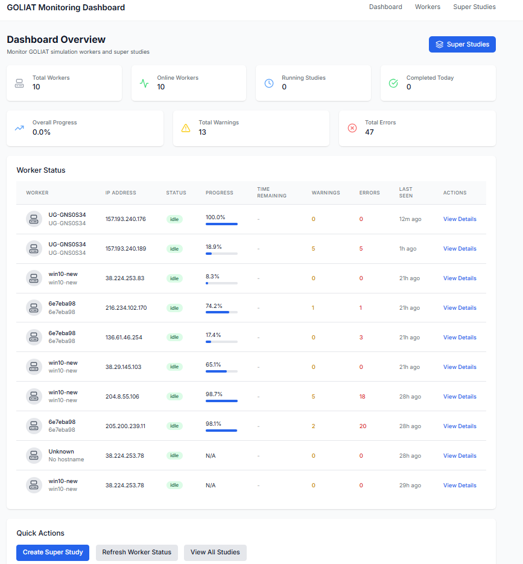
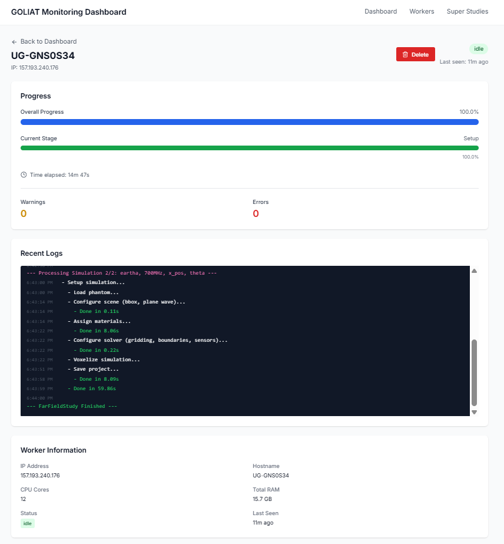
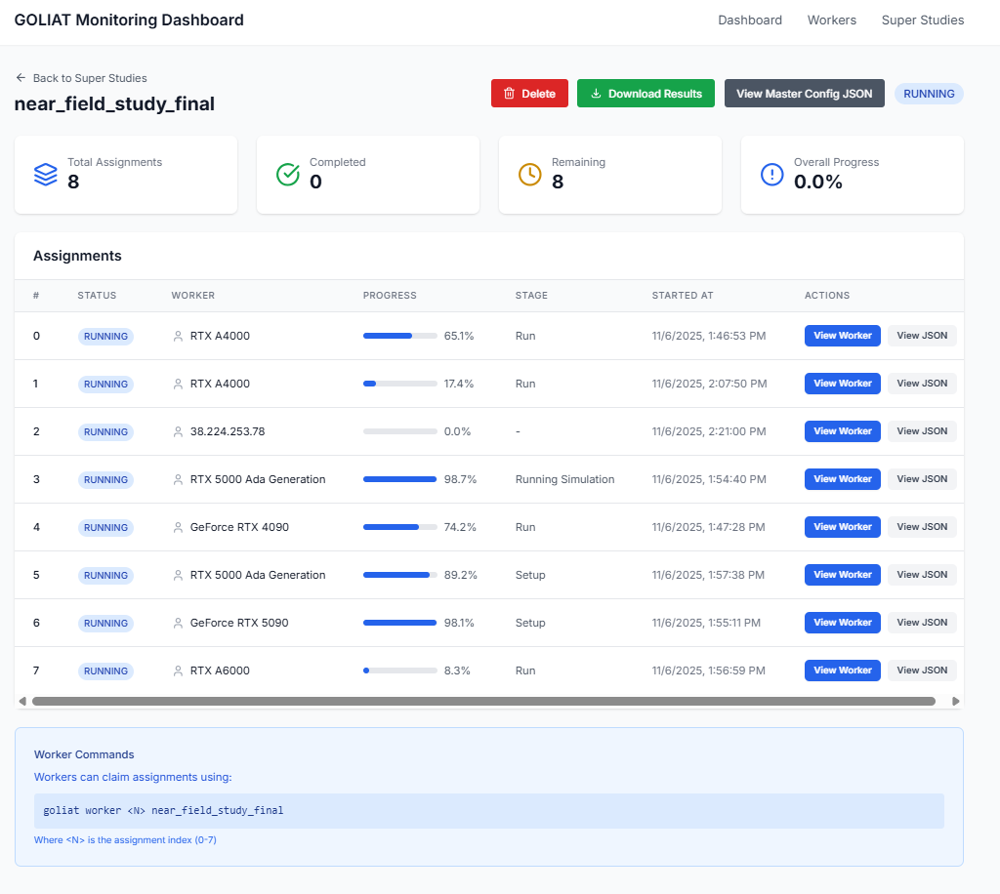

# GOLIAT Monitoring Dashboard

Web-based monitoring dashboard for orchestrating and monitoring GOLIAT simulation studies across multiple worker machines. Provides centralized visibility into distributed execution, progress tracking, and result management.

**Live dashboard:** [https://goliat.waves-ugent.be](https://goliat.waves-ugent.be)

## Overview

The monitoring dashboard coordinates distributed GOLIAT simulations across multiple cloud VMs or local machines. Workers automatically connect and report progress, while the dashboard provides real-time status, log streaming, and result file management.

This is a companion project to [GOLIAT](https://github.com/rwydaegh/goliat), the main simulation framework. See the [GOLIAT cloud documentation](https://rwydaegh.github.io/goliat/cloud/monitoring/) for integration details.



<details>
<summary>More screenshots</summary>

### Workers view



### Super studies view



</details>

## Features

### Worker monitoring

- Real-time status indicators (green for online/idle, blue for running, red for offline/error)
- Automatic worker registration via heartbeat system
- Worker session management with stale worker detection
- IP-based identification with hostname fallback for VPN reconnections
- System information display (GPU model, CPU cores, RAM capacity)
- Last seen timestamp tracking

### Progress tracking

- Overall progress percentage per worker (0-100%)
- Stage-level progress within current simulation phase
- Master progress aggregation across all workers in super studies
- Weighted progress calculation based on assignment complexity
- ETA estimation and time remaining calculations
- Progress event history

### Live log streaming

- Real-time log message streaming from workers
- Color-coded log types (success, warning, error, info, progress)
- All log messages stored per worker (no limit)
- Timestamped log entries
- Automatic log scrolling to latest messages

### Super study orchestration

- Config file splitting into multiple assignments
- Automatic assignment distribution across workers
- Worker assignment claiming system
- Assignment status tracking (pending, running, completed, failed)
- Master progress bar showing overall completion
- Assignment-level progress monitoring
- Result file aggregation from all assignments

### Result management

- Result file storage in PostgreSQL (JSON, PNG, pickle files)
- File explorer interface for browsing results
- Hierarchical file tree structure
- Individual file download and viewing
- Text file preview (JSON, CSV, logs)
- Binary file download (images, pickles)
- Total file count and size statistics

### Dashboard views

- Overview dashboard with aggregate statistics
- Worker list page with detailed status table
- Individual worker detail pages with full progress and logs
- Super study list page
- Super study detail pages with assignment breakdown
- Real-time updates via polling (3-5 second intervals)

### Integration features

- Automatic connection from GOLIAT GUI (no manual configuration)
- Heartbeat system (30-second intervals)
- GUI state synchronization (progress, stage, ETA, logs)
- Message throttling to prevent API overload
- Offline resilience (workers continue locally if dashboard unavailable)
- Connection status indicator in GOLIAT GUI

## Quick start

### Development

```bash
npm install
npm run dev
```

The dashboard runs on `http://localhost:3000` by default.

### Deployment

Configured for Railway deployment with PostgreSQL:

1. Fork or clone this repository
2. Connect to Railway
3. Add PostgreSQL service
4. Deploy

Database migrations run automatically during the build process.

## Technology stack

- **Frontend**: Next.js 14 (App Router) + TypeScript
- **Styling**: Tailwind CSS
- **Database**: PostgreSQL (Railway)
- **ORM**: Prisma
- **Deployment**: Railway
- **Worker integration**: Python 3.11+ with `requests` library

## Configuration

### Dashboard URL

The GOLIAT client connects to the monitoring dashboard automatically. The default URL is `https://goliat.waves-ugent.be`. To use a different URL, set the `GOLIAT_MONITORING_URL` environment variable.

### Worker identification

Workers are identified by their IP address. If a worker's IP changes (e.g., VPN reconnection), the dashboard matches by hostname and transfers running assignments to the new worker session. Workers without a heartbeat for 5+ minutes are marked as stale.

### Automatic connection

No configuration needed on worker machines. When GOLIAT runs with web monitoring enabled:

1. Detects machine's public IP (or uses local IP if no public IP)
2. Connects to the monitoring dashboard
3. Sends periodic heartbeats every 30 seconds
4. Forwards GUI messages (progress, logs, status) to the dashboard

The GOLIAT GUI shows a connection status indicator (green dot for connected, red dot for disconnected).

## API endpoints

### Workers

- `GET /api/workers` - List all registered workers
- `GET /api/workers/[id]` - Get worker details with GUI state
- `DELETE /api/workers/[id]` - Delete worker and associated data

### Heartbeat

- `POST /api/heartbeat` - Worker heartbeat (automatic, every 30 seconds)
- `GET /api/heartbeat?ipAddress=<ip>` - Check worker status by IP

### GUI updates

- `POST /api/gui-update` - GUI state updates (automatic, throttled)

### Super studies

- `GET /api/super-studies` - List all super studies
- `GET /api/super-studies?name=<name>` - Find super study by name
- `GET /api/super-studies/[id]` - Get super study details
- `DELETE /api/super-studies/[id]` - Delete super study

### Assignments

- `GET /api/super-studies/[id]/assignments` - List assignments for a super study
- `POST /api/assignments/[id]/claim` - Claim an assignment (automatic)
- `POST /api/assignments/[id]/results` - Upload result files (automatic)

### Results

- `GET /api/super-studies/[id]/results/list` - List all result files as file tree
- `GET /api/super-studies/[id]/results/file?path=<path>` - Get file content
- `GET /api/super-studies/[id]/results/download` - Download all results as ZIP

## Related documentation

- [GOLIAT main repository](https://github.com/rwydaegh/goliat) - The simulation framework
- [GOLIAT cloud documentation](https://rwydaegh.github.io/goliat/cloud/monitoring/) - Monitoring dashboard integration guide
- [Super studies guide](https://rwydaegh.github.io/goliat/cloud/super_studies/) - Distributed execution workflow
- [Cloud setup guide](https://rwydaegh.github.io/goliat/cloud/cloud_setup/) - Deploying cloud GPU instances

## Local documentation

- [Architecture](./docs/architecture.md) - System architecture and design decisions
- [Railway deployment](./docs/railway-deployment.md) - Deployment guide
- [Database migrations](./docs/railway-migrations.md) - Database setup and migration guide
- [Troubleshooting](./docs/troubleshooting-worker-not-appearing.md) - Common issues and solutions
- [Environment variables](./docs/environment-variables-guide.md) - Configuration reference

## Testing

See `TEST_API.md` for API testing instructions and examples.

## License

MIT
