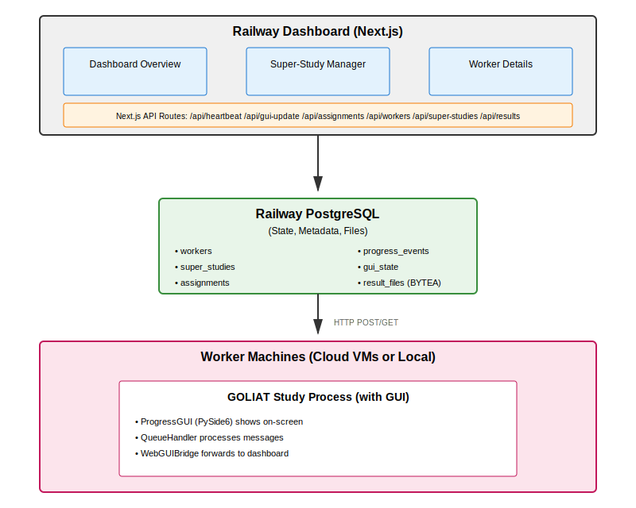

# Architecture overview

Web-based monitoring dashboard for orchestrating and monitoring GOLIAT simulation studies across multiple worker machines. Provides centralized visibility into distributed execution, progress tracking, and result management.

## High-level architecture

## Technology stack

### Frontend
- Framework: Next.js 14 (App Router)
- Language: TypeScript
- Styling: Tailwind CSS
- State Management: React hooks + API polling (3-5 second intervals)

### Backend
- Database: PostgreSQL (Railway)
- ORM: Prisma
- API: Next.js API Routes (serverless functions)
- File Storage: PostgreSQL BYTEA columns (result files stored in database)

### Worker integration
- Language: Python 3.11+ (part of GOLIAT)
- Dependencies: `requests` library
- Integration: Built into GOLIAT GUI, no separate agent needed

## Key design decisions

### 1. Storage strategy

All data stored in PostgreSQL:
- State/metadata: Workers, assignments, progress events, GUI state
- Result files: Stored as BYTEA in `result_files` table (JSON, PNG, pickle files)
- Rationale: Single database simplifies deployment, no separate file storage service needed

### 2. Worker identification

- Primary: IP address (auto-detected by GOLIAT)
- Fallback: Hostname matching for VPN reconnections
- Session management: Workers get unique session IDs, stale workers (5+ minutes idle) are marked inactive
- Assignment transfer: Running assignments transfer to new worker session if IP changes

### 3. Heartbeat system

- Interval: 30 seconds
- Timeout: Workers marked offline if no heartbeat for 30+ seconds
- Purpose: Track worker availability and detect disconnections

### 4. Super study orchestration

- Config splitting: Done client-side via `goliat super_study` command
- Assignment claiming: Workers claim assignments via `/api/assignments/[id]/claim`
- Progress aggregation: Master progress calculated from completed assignments
- Result collection: Workers upload result files to `/api/assignments/[id]/results`

### 5. Log storage

- Storage: All log messages stored in `gui_state.logMessages` JSON array
- No limit: All logs retained (no truncation)
- Display: UI shows all logs with scrolling container

## Data flow

### Worker connection

1. GOLIAT study starts with GUI enabled
2. WebGUIBridge detects machine IP (public or local)
3. Sends initial heartbeat to `/api/heartbeat`
4. Dashboard creates or updates worker record
5. Worker appears on dashboard as "idle"

### Progress updates

1. GOLIAT sends messages to multiprocessing queue
2. QueueHandler processes message, updates Qt GUI
3. WebGUIBridge forwards message to `/api/gui-update`
4. Server updates `gui_state` table (progress, stage, logs, ETA)
5. Dashboard polls `/api/workers` every 3-5 seconds, displays updates

### Super study execution

1. User runs `goliat super_study <config> --name <name> --num-splits N`
2. Client splits config into N assignments, uploads to `/api/super-studies`
3. Workers run `goliat worker <index> <name>`
4. Worker fetches assignment config from `/api/assignments/[id]/claim`
5. Worker claims assignment, runs simulation
6. Progress updates sent to `/api/gui-update`
7. On completion, result files uploaded to `/api/assignments/[id]/results`
8. Assignment marked complete, super study progress updated

### Result file management

1. Workers upload result files after study completion
2. Files stored in PostgreSQL `result_files` table (BYTEA)
3. File tree built from `relativePath` and `filename`
4. Users browse via file explorer component
5. Individual files downloadable via `/api/super-studies/[id]/results/file`
6. Bulk download via `/api/super-studies/[id]/results/download` (ZIP)

## Scalability considerations

- Worker capacity: Tested with 8-16 workers, scales to more
- Update frequency: Throttled GUI updates (~5Hz per worker)
- Database size: PostgreSQL handles result files efficiently (BYTEA)
- Polling: Dashboard polls every 3-5 seconds (could use WebSockets for better scaling)

## Security notes

- No authentication: Public access (as designed)
- IP-based identification: Workers identified by IP address
- No sensitive data: No credentials transmitted, only simulation data

## Current features

- Worker status monitoring (online/idle/running/offline/error)
- Real-time progress tracking (overall and stage-level)
- Live log streaming with color coding
- Super study orchestration
- Result file storage and browsing
- Assignment claiming and tracking
- ETA estimation
- Warning and error counting
